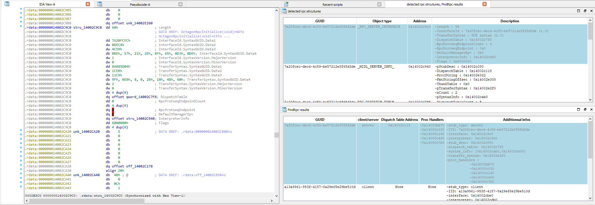
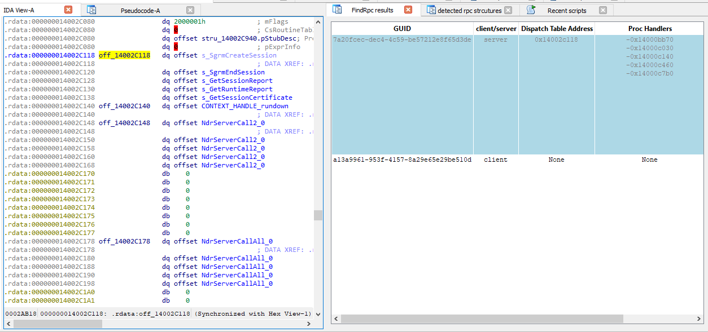

findrpc : Ida script to extract RPC interface from binaries
=============================================================

Usage
------------

Just run the script `findrpc.py`.

NB : wait for the autoanalysis to finish before running the script.
NBB : if you want to regenerate the IDL, you need to have the `decompile` folder in the same directory as `findrpc.py`

The script rely on the same heuristic as James Forshaw's (`FindRpcServerInterfaces`)[https://github.com/googleprojectzero/sandbox-attacksurface-analysis-tools/blob/master/NtApiDotNet/Win32/RpcServer.cs#L373 ] but is a bit more powerful since it can use IDA's xrefs system to uncover "non-obvious" structures between RPC structures  (e.g. in the case of a proxy definition).

Unlike `RpcView` or `NtApiDotNet`, also return the RPC clients embbeded in the binary, which may be of use when reversing.  

Features
------------

* View in a glance which RPC clients and servers are embedded in the binary :



* Locate dispatch tables for RPC servers:



* (On Windows) Generate decompiled IDL from RPC declarations :


Study Example #1 : SgrmBroker
-----------------------------

Some RPC servers are not accessible via RpcView or NtObjectManager, although any clients can connect to it. One prime example is `SgrmBroker` which is a service running as PPL on Windows 10. Protected Processes Light (PPL) are famously protected against remote process memory reading, even if thoses processes are running as admin, thus why RpcView fail at localizing the interface.

`findrpc` can find it since it rely only on the binary :


Decompiled Interface :

```idl
// DllOffset: 0x2C9C0
// DllPath O:\Legifrance\binaries\findrpc\SgrmBroker_10.0.18362.1_WinBuild.160101.0800_2DF8A183.exe
// Complex Types:
/* Memory Size: 132 */
struct Struct_0 {
    /* Offset: 0 */ sbyte[128] Member0;
    /* Offset: 128 */ int Member1;
};


[uuid("7a20fcec-dec4-4c59-be57-212e8f65d3de"), version(1.0)]
interface intf_7a20fcec_dec4_4c59_be57_212e8f65d3de {

    HRESULT SgrmCreateSession(
    	/* Stack Offset: 0 */ handle_t p0, 
    	/* Stack Offset: 8 */ [In] wchar_t[1]* p1, 
    	/* Stack Offset: 16 */ [In] struct Struct_0* p2, 
    	/* Stack Offset: 24 */ [Out] /* FC_BIND_CONTEXT */ handle_t* p3, 
    	/* Stack Offset: 32 */ [Out] UIntPtr* p4
    );

    HRESULT SgrmEndSession(
    	/* Stack Offset: 0 */ handle_t p0, 
    	/* Stack Offset: 8 */ [In, Out] /* FC_BIND_CONTEXT */ handle_t* p1
    );

    HRESULT GetSessionReport(
    	/* Stack Offset: 0 */ handle_t p0, 
    	/* Stack Offset: 8 */ [In] /* FC_BIND_CONTEXT */ handle_t* p1, 
    	/* Stack Offset: 16 */ [Out] /* C:(FC_TOP_LEVEL_CONFORMANCE)(24)(FC_DEREFERENCE)(FC_ULONG)(0) */ sbyte[]* p2, 
    	/* Stack Offset: 24 */ [Out] int* p3
    );

    HRESULT GetRuntimeReport(
    	/* Stack Offset: 0 */ handle_t p0, 
    	/* Stack Offset: 8 */ [In] /* FC_BIND_CONTEXT */ handle_t* p1, 
    	/* Stack Offset: 16 */ [In] struct Struct_0* p2, 
    	/* Stack Offset: 24 */ [Out] /* C:(FC_TOP_LEVEL_CONFORMANCE)(32)(FC_DEREFERENCE)(FC_ULONG)(0) */ sbyte[]* p3, 
    	/* Stack Offset: 32 */ [Out] int* p4
    );

    HRESULT GetSessionCertificate(
    	/* Stack Offset: 0 */ handle_t p0, 
    	/* Stack Offset: 8 */ [In] /* FC_BIND_CONTEXT */ handle_t* p1, 
    	/* Stack Offset: 16 */ [Out] /* C:(FC_TOP_LEVEL_CONFORMANCE)(24)(FC_DEREFERENCE)(FC_ULONG)(0) */ sbyte[]* p2, 
    	/* Stack Offset: 24 */ [Out] int* p3
    );
}
```


Study Example #2 : WarpJITSvc
-----------------------------


Some Windows services are only running "on demand" and exit as soon as they are done processing the client calls. This is the case for `WarpJITSvc` : this is a Windows service which provide CPU-generated shaders when there is no graphic acceleration provided by system (e.g. on a server or in a VM).

`WarpJITSvc` is "triggered" when a client attempt to access the RPC interface `"5a0ce74d-f9cf-4dea-a4c1-2d5fe4c89d51"`. The rasterization RPC server is not present in its ServiceDLL `Windows.WARP.JITService.dll` but in one of its dependency, `d3d10warp.dll`


```idl
// DllOffset: 0x5D5B70
// DllPath C:\Windows\System32\d3d10warp.dll

[uuid("5a0ce74d-f9cf-4dea-a4c1-2d5fe4c89d51"), version(1.0)]
interface intf_5a0ce74d_f9cf_4dea_a4c1_2d5fe4c89d51 {

    HRESULT WARPJITOOPServerConnect(
    	/* Stack Offset: 0 */ handle_t p0, 
    	/* Stack Offset: 8 */ [In] /* FC_SYSTEM_HANDLE Process(VmOperation, VmRead, VmWrite, QueryLimitedInformation, Synchronize) */ HANDLE p1, 
    	/* Stack Offset: 16 */ [In] int p2, 
    	/* Stack Offset: 24 */ [In] /* C:(FC_TOP_LEVEL_CONFORMANCE)(16)(FC_ZERO)(FC_ULONG)(Early) */ byte[]* p3, 
    	/* Stack Offset: 32 */ [In] /* range: 0,2147483647 */ int p4, 
    	/* Stack Offset: 40 */ [Out] int* p5, 
    	/* Stack Offset: 48 */ [Out] /* C:(FC_TOP_LEVEL_CONFORMANCE)(32)(FC_ZERO)(FC_ULONG)(17)V:(FC_TOP_LEVEL_CONFORMANCE)(40)(FC_DEREFERENCE)(FC_ULONG)(Early) */ byte[]* p6
    );

    HRESULT WARPJITOOPServerPassMessage(
    	/* Stack Offset: 0 */ handle_t p0, 
    	/* Stack Offset: 8 */ [In] int p1, 
    	/* Stack Offset: 16 */ [In] /* C:(FC_TOP_LEVEL_CONFORMANCE)(8)(FC_ZERO)(FC_ULONG)(Early) */ byte[]* p2, 
    	/* Stack Offset: 24 */ [In] /* range: 0,2147483647 */ int p3, 
    	/* Stack Offset: 32 */ [Out] int* p4, 
    	/* Stack Offset: 40 */ [Out] /* C:(FC_TOP_LEVEL_CONFORMANCE)(24)(FC_ZERO)(FC_ULONG)(17)V:(FC_TOP_LEVEL_CONFORMANCE)(32)(FC_DEREFERENCE)(FC_ULONG)(Early) */ byte[]* p5
    );

    HRESULT WARPJITOOPServerGetConnectionUUID(
    	/* Stack Offset: 8 */ handle_t p0, 
    	/* Stack Offset: 16 */ [In] /* range: 0,2147483647 */ int p1, 
    	/* Stack Offset: 24 */ [Out] int* p2, 
    	/* Stack Offset: 32 */ [Out] /* C:(FC_TOP_LEVEL_CONFORMANCE)(16)(FC_ZERO)(FC_ULONG)(17)V:(FC_TOP_LEVEL_CONFORMANCE)(24)(FC_DEREFERENCE)(FC_ULONG)(Early) */ byte[]* p3
    );

    HRESULT WARPJITOOPServerGetConnectionUUID2(
    	/* Stack Offset: 8 */ handle_t p0, 
    	/* Stack Offset: 16 */ [In] /* range: 0,2147483647 */ int p1, 
    	/* Stack Offset: 24 */ [Out] int* p2, 
    	/* Stack Offset: 32 */ [Out] /* C:(FC_TOP_LEVEL_CONFORMANCE)(16)(FC_ZERO)(FC_ULONG)(17)V:(FC_TOP_LEVEL_CONFORMANCE)(24)(FC_DEREFERENCE)(FC_ULONG)(Early) */ byte[]* p3
    );
}
```


References
------------

* RpcView : https://github.com/silverf0x/RpcView/
* James Forshaw's NtApiDotNet : https://github.com/googleprojectzero/sandbox-attacksurface-analysis-tools/tree/master/NtApiDotNet